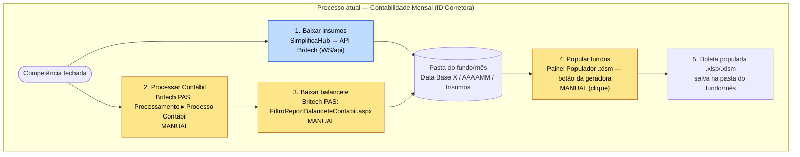

# 01 — Processo atual: Contabilidade Mensal (exemplo ID Corretora)

Fonte de verdade: `docs/processo_contabilidade_mensal.png` (lida e transcrita abaixo), conferida contra o disco e contra o código dos projetos existentes. Onde a imagem e o texto do prompt divergem, a imagem prevalece (ver "Divergências").

## 1. Transcrição da imagem

Título: **"Processo atual que deve ser automatizado da Contabilidade Mensal"** — legenda: *"exemplo com ID CORRETORA"*.

1. **Baixar insumos → Simplifica**
2. **Processar Contábil → Sistema (manual)** — o print mostra o menu da Britech: `Integrações`, `Processamento ▸ [Processo Período · Processo Período - Trader · Processo Contábil · Processo Rentabilidade · …]`, `Relatórios`, `Segurança`. O item usado é **Processamento ▸ Processo Contábil**.
3. **Baixar balancete → Sistema (manual)** — `https://id.britech.com.br/PAS/Relatorios/Legais/Contabil/FiltroReportBalanceteContabil.aspx`
4. **Popular fundos** — "Excel onde os insumos preenchem diferentes abas; ocorre depois deles pressionarem o botão da geradora" → `G:\Drives compartilhados\Contabilidade de Fundos - ID Corretora\Painel Populador ID CORRETORA - Contabilidade de Fundos.xlsm`
5. **Excel já populado fica salvo na pasta do fundo, no mês vigente** — exemplo:
   `G:\...\Contabilidade de Fundos - ID Corretora\FIDC\FIDC ACELERA CASH\Data Base Novembro 2026\202608\Boleta FIDC ACELERA CASH 082026.xlsb`

## 2. Etapas detalhadas

| # | Etapa | Sistema | Entrada | Saída | Quem executa hoje | Frequência | Dependências / decisões |
|---|---|---|---|---|---|---|---|
| 1 | Baixar insumos | SimplificaHub (ferramenta `britech_mensal_contabilidade`, que consome a API REST da Britech — *inferido, ver 03*) | fundo/carteira, data fim, credenciais Britech | Pasta `Insumos/` do fundo/mês: Carteira (Final e Inicial), ExtratoCC, MovCotista, SaldoAplicacaoCotista (Final e Inicial), Histórico de Cota — `.xlsx` + `.pdf` | Humano dispara no Simplifica; download em si é por API | Mensal, por fundo | Cadastro do fundo/carteira correto; credencial da administradora |
| 2 | Processar Contábil | Britech PAS (web) — Processamento ▸ Processo Contábil | carteira(s) selecionada(s) no grid | Contabilidade do período processada no sistema | **Manual.** (Lucas automatizou até a seleção de carteiras; o clique em "Processar" está desativado) | Mensal, por lote de carteiras | **Deve terminar antes da etapa 3.** Ponto de decisão: processamento concluído? (como saber: desconhecido) |
| 3 | Baixar balancete | Britech PAS (web) — relatório legal | carteira, data início/fim | `BalanceteContabil_<cnpj>.pdf` e `BalanceteContabil_<idcarteira>_<cnpj>_.xls` (nomes sugeridos pela Britech — confirmado nos logs do Lucas) | **Manual.** (Lucas: Playwright, datas fixas) | Mensal, por carteira | Depende da 2. O arquivo precisa acabar na pasta `Insumos/` do fundo/mês (hoje colocado à mão) |
| 4 | Popular fundos | Excel — Painel Populador `.xlsm`, macro `ProcessarEmLoop` | fundos marcados com "X" no Painel; `Insumos/`; arquivo do mês anterior | Arquivo do mês com abas Carteira final/inicial, Extrato, Balancete, Posicao_Cotista, Mov_Cotista repopuladas | **Manual (clique no botão da geradora).** Este repositório contém um substituto em Python (COM/Excel) já validado | Mensal, em lote | Depende de 1 e 3; depende de existir arquivo do mês anterior na pasta de origem; se já existe saída no mês → pula |
| 5 | Salvar boleta | Shared Drive (`G:`) | arquivo populado | `.xlsb` (ou `.xlsm`) em `<Tipo>\<Fundo>\Data Base <Exercício>\<AAAAMM>\` | Automático pela macro (grava na pasta do mês vigente) | Mensal | Nome final varia (ver divergência 1) |

Pontos de decisão do fluxo: (a) processamento contábil concluído? · (b) todos os insumos presentes e reconhecíveis? · (c) existe arquivo do mês anterior para servir de base? · (d) já existe saída do mês → pular.

## 3. Fluxo como é hoje (Mermaid)

Legenda: amarelo = manual; azul = disparo humano com execução por API.

## 4. Divergências entre o prompt e a imagem (a imagem prevalece)

1. **Nome do arquivo final.** A imagem mostra `Boleta FIDC ACELERA CASH 082026.xlsb` (padrão *"Boleta <fundo> MMAAAA"*) dentro da pasta `202608`. Conferi em disco: o arquivo existe (2,8 MB, 09/09/2026). Já a macro original (e o nosso populador) nomeia `<fundo> AAAAMM.<ext>` — ex.: `FII LAZIO II 202509.xlsb`. **O padrão de nome da boleta não é único** → pergunta aberta.
2. **Gatilho da etapa 4.** O prompt diz só "popular os fundos"; a imagem deixa claro que ocorre *depois de as pessoas pressionarem o botão da geradora* — é um gatilho humano, não uma etapa contínua.
3. **Formato.** O prompt afirma `.xlsb`; em disco há também `.xlsm` (ex.: `FII KRONOS 202509.xlsm`). A extensão do arquivo novo é herdada do arquivo do mês anterior.
4. **Sem divergência** nas etapas 1–3 (ordem, sistemas e caráter manual batem com o prompt).

## 5. Evidências adicionais úteis para a arquitetura

- **Três "famílias" de nome nos `Insumos/`**, que correspondem a origens diferentes:
  1. Downloader do Simplifica (mais recente): `AAAAMM_<cnpj>_CarteiraFinal.xlsx`, `..._CarteiraInicial.xlsx`, `..._ExtratoCC.xlsx`, `AAAAMM_<idcarteira>_<cnpj>_MovCotista.xlsx`, `..._SaldoAplicacaoCotistaFinal/Inicial.xlsx`, `..._Histórico de Cota.xlsx`;
  2. Download direto da Britech (nome sugerido pelo sistema): `BalanceteContabil_<cnpj>.pdf`, `BalanceteContabil_<idcarteira>_<cnpj>_.xls`;
  3. Renomeados/gerados à mão (ex.: `Balancete 30.09.xls`) e versões antigas do downloader (`Carteira.xlsx`, `MovCotista.xls`).
  Isso explica por que o casamento por nome fixo da macro VBA falha na maioria dos fundos hoje — e indica que, se o pipeline unificado baixar tudo, ele pode **impor nomes canônicos** e eliminar a heurística de reconhecimento.
- O fundo de exemplo (`FIDC ACELERA CASH`) tem `Insumos/` com o balancete no nome sugerido pela Britech (`BalanceteContabil_46557432_46557432000107_ (3).xls` — o "(3)" indica downloads repetidos), coerente com a etapa 3 manual.
