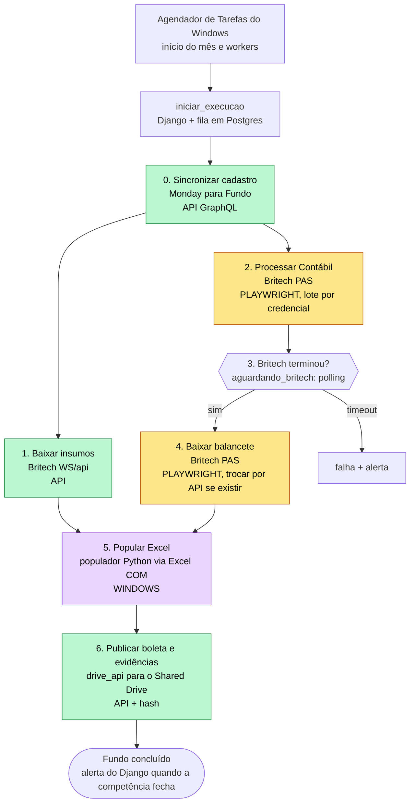
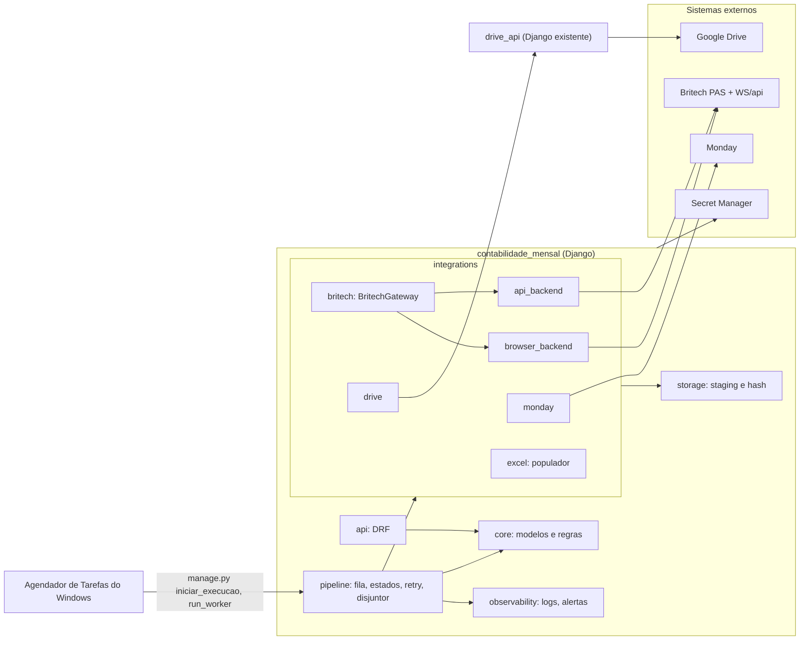
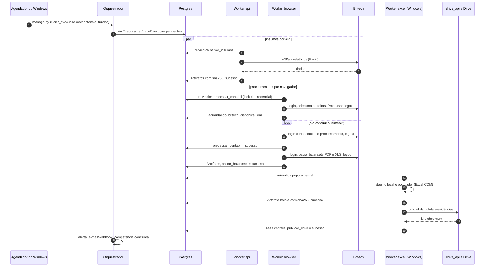
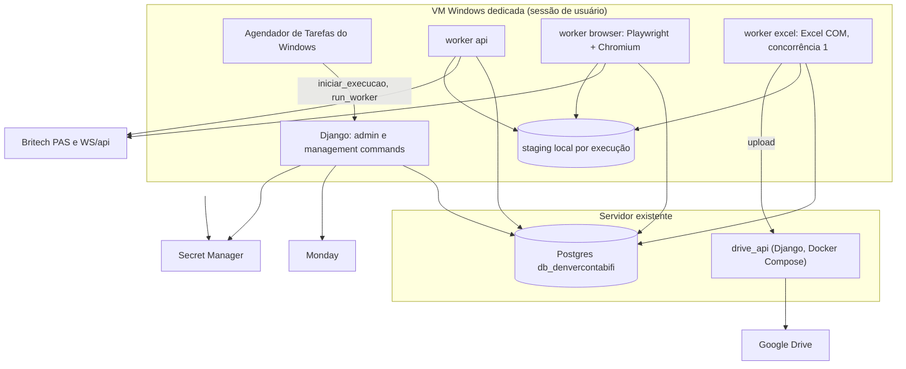
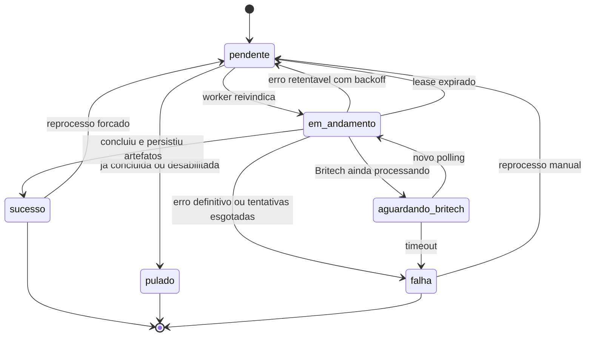

# 05 — Arquitetura proposta (Fase 2)

Documento de arquitetura, **sem código de produção**. Baseado nos relatórios 01–04 e em `perguntas_abertas.md`.

## 0. Premissas e o que preciso que você aprove

**Confirmado por você (29/09/2026):** as etapas *Processar Contábil* e *balancete* só existem via navegador e são exatamente o que o projeto do Lucas faz → o **backend Playwright** (portado do Lucas) cobre as etapas 2–4 até se provar que existe API.

**Premissas que assumi por falta de resposta** (ajustáveis; ver `perguntas_abertas.md`):

| Premissa | Ligada a | Efeito no desenho |
|---|---|---|
| Nova base: pacote **Django `contabilidade_mensal/`** que reaproveita o populador (etapa Excel), porta o cliente Britech `WS/api` do downloader do Simplifica e chama o `drive_api` existente | Q1 | Estrutura da seção 2 |
| Escopo inicial **ID Corretora**, mas `Administradora` é uma entidade (não constante), porque o Lucas já cobre 12 | Q3 | Sem retrabalho se o escopo crescer |
| Não sabemos se *Processar Contábil* é assíncrono nem como saber que terminou | Q4 | Estado `aguardando_britech` + polling configurável |
| A PAS parece permitir **1 sessão por usuário** | Q12 | Lock por credencial; sem reuso de `storage_state` |
| Não há ambiente de homologação da Britech | Q8 | Operações que **alteram** algo (processar, publicar) ficam atrás de flag/allowlist |

**Decisões que peço para aprovar:** (1) fila em **Postgres** (seção 4); (2) **VM Windows dedicada** com Excel (seção 6); (3) populador Python via COM como etapa Excel (seção 5); (4) rotacionar as credenciais expostas **antes** da Fase 3 (Q11).

---

## 1. Princípios

1. **API primeiro, navegador como fallback.** Toda operação na Britech passa por `BritechGateway`; API ou Playwright é detalhe de implementação, escolhido **por operação** via configuração.
2. **Idempotência por (fundo, competência, etapa).** Rodar de novo não duplica processamento nem arquivo: se já houve sucesso com artefatos íntegros, a etapa vira `pulado` (equivalente ao "Arquivo já existe" da macro). Reprocessar exige `forcar`.
3. **Estado explícito e auditável.** Cada etapa tem status, tentativas, erro tipado e duração persistidos.
4. **Falha isolada.** Um fundo com erro não derruba os outros; um erro estrutural (tela mudou) abre um **disjuntor** em vez de queimar 400 fundos.
5. **Evidência de tudo.** Arquivos com SHA-256, logs estruturados, screenshot/trace do Playwright ligados à execução.
6. **Operações que alteram dados são explícitas.** Só `processar_contabil` (altera a contabilidade na Britech) e `publicar_drive` (escreve no Shared Drive) mudam algo fora do nosso sistema; ambas têm *dry-run* e allowlist.

---

## 2. Camadas e módulos

```
contabilidade_mensal/                     # novo repositório (ou renomear este)
├── manage.py
├── config/                               # settings/base|dev|homolog|prod + feature flags por operação
├── contabilidade_mensal/
│   ├── core/            # modelos (seção 3), admin do Django, regras de domínio
│   ├── pipeline/        # grafo de etapas, fila em Postgres (claim/lease), máquina de estados,
│   │                    # retry/backoff, disjuntor, workers (manage.py run_worker --fila <nome>)
│   ├── integrations/
│   │   ├── monday/      # sincroniza cadastro → Fundo (portado do Lucas)
│   │   ├── britech/
│   │   │   ├── interface.py        # BritechGateway (Protocol), DTOs, exceções tipadas
│   │   │   ├── api_backend/        # WS/api (portado do downloader do Simplifica): insumos
│   │   │   ├── browser_backend/    # Playwright (portado do Lucas)
│   │   │   │   ├── session.py      # login/logout confirmados, lock por credencial, tracing pós-login
│   │   │   │   ├── pages/          # login_page, processo_contabil_page, balancete_page (seletores só aqui)
│   │   │   │   └── flows/          # processar_contabil, status_processamento, baixar_balancete
│   │   │   └── factory.py          # CompositeBritechGateway: escolhe o backend por operação
│   │   ├── drive/       # cliente HTTP do drive_api + verificação de hash
│   │   └── excel/       # adapter do populador (biblioteca), Windows-only
│   ├── storage/         # staging local por execução, hashing, retenção
│   ├── observability/   # logging JSON com contexto, alertas (e-mail/webhook enviados pelo próprio Django), métricas
│   └── api/             # DRF: disparar/consultar execuções, matriz fundo × etapa
├── tests/               # unit, integração com fakes, e @pytest.mark.browser (só com flag)
└── docs/
```

**Mapeamento do que existe hoje → onde vai**

| Hoje | Vai para | Observação |
|---|---|---|
| Lucas `britech/pas.py` | `browser_backend/session.py` + `pages/login_page.py`, `processo_contabil_page.py` | mantém login/logout **confirmados** |
| Lucas `britech/balancete.py` | `pages/balancete_page.py` + `flows/baixar_balancete.py` | datas passam a vir da competência |
| Lucas `britech/orquestrador.py` | **descartado** (vira `pipeline/`) | o loop por administradora deixa de existir |
| Lucas `monday_client.py` | `integrations/monday/` | alimenta `Fundo` |
| Lucas `administradoras.py` | tabela `Administradora` | credenciais **não** ficam na tabela (só a referência ao segredo) |
| Lucas `app.py` + `templates/` | **descartado** | substituído por Django admin + API |
| Downloader Simplifica (`*_ctb_britech.py`) | `api_backend/` | mesmos endpoints e nomes canônicos de saída |
| `drive_api` | serviço existente, consumido por `integrations/drive/` | não reescrever |
| Este repo `populador/` | `integrations/excel/` (como biblioteca) | ver seção 5 |

### 2.1 Interface `BritechGateway`

Operações (contrato — assinaturas ilustrativas, não código final):

```python
class BritechGateway(Protocol):
    def sessao(self, administradora: Administradora) -> ContextManager[SessaoBritech]: ...   # login…logout garantido
    def baixar_insumo(self, s, fundo, competencia, tipo: TipoInsumo) -> ArtefatoBaixado: ...  # API hoje
    def processar_contabil(self, s, fundos: Sequence[Fundo], competencia) -> ResultadoDisparo: ...  # navegador hoje
    def status_processamento(self, s, fundo, competencia) -> StatusProcessamento: ...         # navegador hoje
    def baixar_balancete(self, s, fundo, competencia) -> BalanceteBaixado: ...               # PDF + XLS, navegador hoje
```

- `SessaoBritech` é **opaca**: na API é só o contexto de autenticação (Basic); no navegador é `Browser/Context/Page` já logados. O `CompositeBritechGateway` abre cada tipo de sessão **preguiçosamente**, então uma execução 100% via API nunca sobe Chromium.
- Backend por operação, **sem deploy**: `BRITECH_BACKEND_BAIXAR_INSUMO=api`, `..._PROCESSAR_CONTABIL=browser`, `..._STATUS_PROCESSAMENTO=browser`, `..._BAIXAR_BALANCETE=browser`.
- Lote: `processar_contabil` recebe **vários** fundos da mesma administradora (a tela do Lucas seleciona carteiras cumulativamente e clica **uma vez**).

### 2.2 Contrato de erros

| Exceção | Quando | Retentável? | Ação do pipeline |
|---|---|---|---|
| `AutenticacaoFalhou` | usuário/senha recusados | **Não** | falha imediata, alerta, **abre disjuntor da credencial** (evita bloqueio de conta) |
| `SessaoBloqueada` | login barrado por sessão presa / logout não confirmado | Sim, com espera longa | aguarda e alerta; não tenta em loop |
| `TelaMudou` | seletor/estrutura inesperada | **Não** (não adianta repetir) | falha, screenshot+trace, contribui para o **disjuntor** |
| `CarteiraNaoEncontrada` | 0 ou >1 resultado na busca | Não | falha do fundo, cadastro a revisar |
| `ProcessamentoPendente` | Britech ainda processando | — | vira `aguardando_britech` (não é erro) |
| `TimeoutBritech` | lentidão/overlay de loading | Sim | backoff exponencial |
| `ArquivoInvalido` | download vazio/formato inesperado | Sim (1–2×) | reexecuta; se persistir, falha |
| `ErroApiBritech` (HTTP 5xx/timeout) | API | Sim | backoff; 4xx (exceto 429) **não** retenta |
| `LimiteTaxa` (429) | excesso de chamadas | Sim | respeita `Retry-After`, reduz concorrência |

---

## 3. Modelo de dados (Postgres; Django ORM)

Banco sugerido: o `db_denvercontabifi`, que o `drive_api` já cita como o lugar dos "dados internos de fundos" — evita mais um banco.

| Tabela | Campos principais | Índices / unicidade |
|---|---|---|
| **Administradora** | nome, `url_adm`, `segredo_ref` (nome do segredo no cofre), `max_sessoes` (=1), ativa | unique(nome) |
| **Fundo** | administradora FK, `codigo_britech` (id da carteira), `cnpj`, nome, `tipo` (FIF/FIDC/FII/FIP/…), `exercicio_mes`, `pasta_drive_id`, `monday_item_id`, ativo | unique(administradora, codigo_britech); index(cnpj); index(tipo) |
| **Competencia** | ano, mes, `data_base` (fim do mês), status (aberta / em_execucao / concluida / concluida_com_falhas) | unique(ano, mes) |
| **Execucao** | competencia FK, `disparada_por` (agendador / usuário / comando), escopo (JSON: fundos, etapas), `forcar`, início, fim, status, `correlation_id` (UUID) | index(competencia, início) |
| **EtapaExecucao** | execucao FK, fundo FK, `etapa`, `backend` (api / browser / excel / drive), tentativas, `max_tentativas`, status, `erro_tipo`, `erro_msg`, início, fim, `duracao_ms`, `disponivel_em` (backoff / polling), `lock_key` (ex.: `britech:<administradora>`), `worker_id`, `lease_ate` | unique(execucao, fundo, etapa); index(status, disponivel_em); index(lock_key, status) |
| **EstadoEtapa** *(snapshot vigente)* | fundo FK, competencia FK, etapa, `ultima_etapa_execucao` FK, status vigente | unique(fundo, competencia, etapa) — base da **idempotência** e do painel |
| **Artefato** | etapa_execucao FK, `tipo` (insumo_*, balancete_pdf, balancete_xls, boleta, screenshot, trace, log), nome, `caminho_local`, `sha256`, tamanho, `drive_file_id`, `drive_checksum`, `verificado_em`, criado_em | index(sha256); index(etapa_execucao, tipo) |
| **PastaCompetencia** | fundo FK, competencia FK, `drive_folder_id`, caminho relativo | unique(fundo, competencia) — cache da pasta `Tipo/Fundo/Data Base X/AAAAMM` |
| **Disjuntor** | chave (`etapa:backend:administradora`), aberto_desde, motivo, `falhas_consecutivas`, `ultimo_erro_tipo`, `proxima_tentativa_em` (meia-abertura), reaberto_por | unique(chave) |
| **TravaRecurso** *(acrescentada na Fase 1)* | chave (`britech:<administradora>`), dono, `lease_ate` | unique(chave) — exclusão mútua sem corrida; ver changelog |

**Etapas** (enum, por fundo): `baixar_insumos` · `processar_contabil` · `baixar_balancete` · `popular_excel` · `publicar_drive`. (A sincronização do cadastro com o Monday é um passo da *execução*, não do fundo.)

**Dependências:** `baixar_insumos` e `processar_contabil` são independentes → `baixar_balancete` depende de `processar_contabil` → `popular_excel` depende de `baixar_insumos` **e** `baixar_balancete` (e da existência do arquivo do mês anterior) → `publicar_drive` depende de `popular_excel`.

**Máquina de estados de `EtapaExecucao`** (diagrama na seção 9.5):

| De → Para | Condição |
|---|---|
| pendente → em_andamento | worker reivindica a linha (`SELECT … FOR UPDATE SKIP LOCKED`) e grava `lease_ate` |
| pendente → pulado | idempotência (já concluída com artefatos íntegros) ou etapa desabilitada |
| em_andamento → sucesso | concluiu e persistiu artefatos + hash |
| em_andamento → falha | erro definitivo ou tentativas esgotadas |
| em_andamento → pendente | erro retentável (incrementa tentativa, define `disponivel_em` com backoff) **ou** lease expirado (worker morreu) |
| em_andamento → aguardando_britech | Britech ainda processando |
| aguardando_britech → em_andamento | vence `disponivel_em` (novo polling) |
| aguardando_britech → falha | passou o timeout configurado |
| falha / sucesso / pulado → pendente | reprocesso manual seletivo / `forcar` (histórico preservado em `Artefato`) |
| pendente → pulado *(por dependência)* | uma etapa da qual esta depende falhou: `erro_tipo=dependencia_falhou`; a execução fecha como `concluida_com_falhas` *(esclarecimento da Fase 1)* |

---

## 4. Orquestração

### 4.1 Decisão: sem n8n — Agendador de Tarefas do Windows

Decisão do usuário: **não usaremos n8n**. O agendamento e o disparo ficam no **Agendador de Tarefas do Windows** (Task Scheduler) da VM dedicada, chamando *management commands* do Django. Não há orquestrador externo: o estado e as regras vivem no código e no banco, a fila é a tabela `EtapaExecucao`.

| Necessidade | Como fica |
|---|---|
| Iniciar o mês | Tarefa agendada diária, 07:00 (a partir do 1º dia útil), roda `manage.py iniciar_execucao --competencia auto`. É **idempotente**: só cria o que falta, então rodar todo dia até esgotar pendências é seguro; ao passar do prazo (Q9) gera alerta |
| Processar a fila | Tarefa(s) agendada(s) "ao iniciar sessão" + repetição a cada 5 min, rodando `manage.py run_worker --fila <api|browser|excel|drive>`; se o worker já estiver rodando a nova instância encerra (mutex/lock em arquivo). Um worker morto é reiniciado na próxima repetição |
| Botão "rodar competência" / reprocesso | Ação no Django admin (ou `manage.py iniciar_execucao --competencia AAAA-MM --fundos … --etapas … --forcar --cascata`) — o mesmo comando, sem HTTP externo |
| Alertas | O próprio Django envia (e-mail SMTP e/ou webhook do Slack; canal a definir — Q24). Tarefa agendada diária `manage.py resumo_diario` para o resumo |
| Watchdog | Tarefa agendada a cada 10 min: `manage.py limpar_orfaos` (leases vencidos, `EXCEL.EXE`/Chromium órfãos) |

Consequência: **tudo roda na VM Windows** (Django, workers e, no MVP, o Postgres pode continuar em servidor separado). O `drive_api` continua como serviço existente. Opção considerada e descartada: Celery/RQ (sem suporte oficial a Windows, e o volume não justifica).

### 4.2 Recomendação: **fila no próprio Postgres**, drenada por workers iniciados pelo Agendador

- **Agendador de Tarefas do Windows**: dispara o início do mês (`iniciar_execucao`), mantém os workers vivos (repetição) e roda o watchdog. **Não** guarda estado nem regra de negócio.
- **Django + workers Python**: donos do estado e das regras.
- **Fila em Postgres** (a tabela `EtapaExecucao` é a fila; claim com `SELECT … FOR UPDATE SKIP LOCKED`), em vez de Celery/RQ, porque: (i) o volume é pequeno — no máximo algumas milhares de etapas por mês (468 registros × 5 etapas ≈ 2 340); (ii) **Celery e RQ dependem de fork/prefork e não têm suporte oficial no Windows** — e o worker do Excel tem que ser Windows; (iii) estado e fila ficam **transacionais** (reprocessar = mudar o status de uma linha); (iv) tira Redis do caminho crítico. Se o volume crescer, troca-se a implementação atrás da mesma função `enfileirar()`.

### 4.3 Concorrência e janela

| Fila (`--fila`) | Onde roda | Concorrência | Regra |
|---|---|---|---|
| `api` | Windows ou Linux | N (começar com 4) | *token bucket* por administradora; respeita 429 |
| `browser` | Windows (MVP) | **1 por credencial** | `lock_key = britech:<administradora>`; um worker reivindica **até K etapas da mesma credencial** e roda numa única sessão (login → seleciona K carteiras → Processar → logout) |
| `excel` | Windows com Excel | **1 por host** | uma instância do Excel por vez; a sessão COM é mantida entre fundos e reiniciada em erro |
| `drive` | qualquer | N | idempotente por hash |

- **Polling sem segurar a sessão:** depois de disparar o processamento, a etapa fica `aguardando_britech`, o worker **faz logout** (libera a credencial) e a etapa volta à fila em `disponivel_em` (ex.: +60 s) para uma sessão curta que só consulta o status; teto configurável (ex.: 30 min).
- **Reprocessamento seletivo:** `manage.py iniciar_execucao --competencia … --fundos … --etapas … --forcar --cascata` (ou a ação no admin). Ex.: "só a etapa 3 do fundo X de agosto" = `etapas:["baixar_balancete"]`; `cascata` marca `popular_excel` e `publicar_drive` como `pendente` de novo.
- **Janela do início do mês:** o Agendador dispara `iniciar_execucao` a partir do primeiro dia útil; o comando é idempotente, então pode rodar todo dia até esgotar pendências; ao passar do prazo (Q9) gera alerta.

---

## 5. Etapa Excel (ponto crítico)

| Opção | Viável? | Avaliação |
|---|---|---|
| 1. Manter o `.xlsm` e rodar a macro `ProcessarEmLoop` via COM/xlwings | Sim | **Não recomendo**: herda os bugs da macro (extensão não atribuída, célula mesclada), depende do Painel aberto e do nome fixo de insumo (que falha na maioria dos fundos) |
| **2. Populador Python (este repo) via COM em Windows com Excel** | **Sim — já existe e foi validado** | **Recomendo.** Faz o mesmo que a macro (cópia 1:1 de faixas), com correções, reconhecimento de insumo e isolamento de erro. Grava `.xlsb`/`.xlsm` porque quem grava é o próprio Excel |
| 3. Reimplementar com openpyxl e gerar `.xlsx` | Tecnicamente sim, se `.xlsb` **não** for exigido (Q5) | **Não por ora.** openpyxl não calcula fórmulas, pode perder formatação/validações/vínculos e, se a boleta tiver macros, exige `keep_vba` com risco. Só vale se Q5 disser que `.xlsx` basta **e** um teste de fidelidade célula a célula passar |
| 4. LibreOffice headless | Só converte formato; não roda a população | **Não** como caminho principal (perda de fidelidade `.xlsb`↔`.xlsx`, macros) |

**Refatoração necessária (Fase 5):** hoje o populador lê a lista de fundos da aba Painel. Para virar etapa do pipeline, expor uma função de biblioteca `popular_fundo(fundo, tipo, exercicio, periodos, raiz_leitura, raiz_saida)` **sem** Painel (o CLI atual vira um invólucro fino). O adapter `integrations/excel` prepara o staging local (insumos + boleta do mês anterior baixada do Drive), chama a função e devolve o `Artefato`.

**Ressalvas:**
- A Microsoft não recomenda nem suporta automação do Office em serviços/sessões não interativas → o worker `excel` roda como **tarefa agendada numa sessão de usuário** (logon automático) em VM dedicada, com *watchdog* que encerra `EXCEL.EXE` órfão (já aconteceu em teste quando uma execução foi interrompida).
- Perguntas para o negócio (já em `perguntas_abertas.md`): o `.xlsb` é exigido a jusante (Q5)? o nome final é `<fundo> AAAAMM` ou `Boleta <fundo> MMAAAA` (Q5)? quem mantém a macro e as funções sem chamador (Q6)?
- O reconhecimento de insumo por palavra-chave continua como **rede de segurança**; com o pipeline gerando os insumos, passamos a **nomes canônicos** (camada "exata" do populador) e a heurística só cobre arquivos legados.

---

## 6. Infraestrutura

### 6.1 Onde roda cada coisa

| Componente | Onde | Por quê |
|---|---|---|
| Postgres, `drive_api` | Servidor existente (Linux/Docker Compose) | `drive_api` já é Docker Compose; sem dependência de Windows |
| Django (admin, comandos), Agendador de Tarefas, workers `excel`, `browser` e `api` | **1 VM Windows dedicada com Excel** | Excel/COM só existe em Windows; o Playwright do Lucas já roda em Windows; um host e o Agendador nativo reduzem partes móveis no MVP (sem n8n, sem Celery) |
| (Depois, se precisar) `browser` em Linux | container com a imagem oficial do Playwright | isolamento/escala, só quando o gargalo for o navegador |

- **Rede:** não sabemos se a Britech restringe por IP (Q10). Se restringir, o(s) host(s) de worker precisam de **IP de saída fixo/VPN**.
- **Staging:** diretório local por execução: `STORAGE_ROOT/<AAAAMM>/<execucao>/<fundo>/…`. Se os workers forem separados em hosts diferentes, o hand-off passa pelo Drive (ou compartilhamento de rede).
- **Armazenamento final:** upload pelo **`drive_api`** (não pelo `G:` montado), com verificação pós-upload: SHA-256 local + checksum devolvido pelo Drive (confirmar quais checksums o `drive_api` expõe; o Drive fornece MD5 e, na API v3 atual, também SHA-1/SHA-256).
- **Banco:** Postgres (`db_denvercontabifi`).

### 6.2 Segredos

- Credenciais Britech por administradora, token do Monday e service account do Google: **em cofre** (o `drive_api` já usa Google Secret Manager via `obter_segredo_json` — reaproveitar). Tabela guarda só `segredo_ref`.
- **Nada de `.env` em Shared Drive** (situação atual do Lucas e do `drive_api`); `.env` só local e fora do Git; rotacionar o que já está exposto (Q11).
- **`storage_state`: não usar no início.** Com sessão única por usuário e logout que pode falhar, reaproveitar sessão aumenta o risco de bloqueio; o padrão é *login → trabalho → logout confirmado* dentro de um lock por credencial. Se um dia for usado: arquivo criptografado, diretório restrito, nunca versionado.
- **Traces do Playwright são sensíveis:** registram as ações com seus argumentos (o texto de `fill` pode incluir a senha). Iniciar o trace **depois** do login (`tracing.start_chunk`) e tratá-lo como artefato restrito, com retenção curta.

### 6.3 Ambientes e como testar sem tocar contabilidade real

| | dev | homologação | produção |
|---|---|---|---|
| Navegador | *headed* | *headless* | *headless* |
| `processar_contabil` | **dry-run**: vai até selecionar a carteira e **não clica** em Processar | só fundos da *allowlist* | liberado por fundo, com rollout gradual |
| `baixar_*` (Britech) | leitura — seguro | idem | idem |
| `popular_excel` | staging local, nunca sobrescreve `G:` | idem | idem |
| `publicar_drive` | pasta `HOMOLOG` no Drive | pasta `HOMOLOG` | pasta real |
| Banco | local | dedicado | dedicado |

Sem ambiente de homologação da Britech (Q8), o "fundo de teste" será um fundo real de baixo risco; por isso as **duas operações que alteram algo** (processar e publicar) ficam sempre atrás de flag + allowlist.

### 6.4 Deploy e rollback

- **`drive_api` (servidor existente):** `docker compose up -d` a partir de imagens versionadas por tag; rollback = subir a tag anterior.
- **VM Windows (Django + workers):** tarefas do Agendador + `git checkout <tag>` + `pip install -r requirements.lock`; rollback = checkout da tag anterior e reinício.
- **Migrações de banco compatíveis com a versão anterior** (expandir → migrar → contrair), para que o rollback do código não exija rollback de schema.

---

## 7. Observabilidade e operação

- **Logs estruturados (JSON)**, com contexto em toda linha: `execucao_id`, `correlation_id`, `fundo`, `competencia`, `etapa`, `backend`, `tentativa`, `worker_id`.
- **Playwright:** screenshot **e** trace em toda falha, salvos como `Artefato` (`screenshot`, `trace`); em sucesso o trace é descartado para economizar espaço.
- **Alertas (enviados pelo Django direto, sem n8n; canal em aberto — Q24: e-mail SMTP e/ou webhook do Slack):** falha de login; `TelaMudou`; fundo com falha após N tentativas; disjuntor aberto; competência concluída (com resumo de sucesso/falha/pulado).
- **Painel de acompanhamento:** MVP = **matriz fundo × etapa da competência corrente** (view Django + admin) a partir de `EstadoEtapa`. Depois, expor a mesma matriz pela API `/api/competencias/<id>/matriz` e **integrar ao app de contabilidade de fundos (layout Hemera Reorganizado)** — não é pré-requisito do pipeline.
- **Runbook (resumo; versão completa na Fase 6):**
  - *A Britech mudou uma tela:* o disjuntor abre (`TelaMudou`); abrir o trace mais recente da falha; ajustar **só** o Page Object; rodar o teste `@pytest.mark.browser` contra o fundo de teste; fechar o disjuntor.
  - *Reprocessar um fundo:* `manage.py iniciar_execucao` com `--fundos`, `--etapas`, `--forcar`, `--cascata` (ou a ação no admin).
  - *Sessão presa na Britech:* aguardar o tempo de expiração e reabrir a credencial no disjuntor; nunca tentar em loop.

---

## 8. Resiliência

- **Retry** com backoff exponencial **com jitter**, teto por tipo de erro (tabela 2.2); **nunca** retentar credencial inválida.
- **Esperas baseadas em estado**: `expect(...).to_be_visible()`, `wait_for_response`, espera de o overlay de loading do DevExpress ficar `hidden` — **sem `sleep` fixo** (os logs do Lucas mostram o overlay `..._LD` interceptando cliques).
- **Processamento em andamento:** polling configurável (`aguardando_britech`) com timeout; a sessão é liberada entre consultas.
- **Disjuntor:** se X fundos seguidos falharem com o mesmo `erro_tipo` no mesmo ponto (chave `etapa:backend:administradora`), pausa aquela fila e alerta; reabre por *half-open* (1 tentativa após o resfriamento) ou manualmente.
- **Órfãos:** `lease_ate` + *heartbeat*; etapa `em_andamento` com lease vencido volta a `pendente`; watchdog de `EXCEL.EXE` e de Chromium.
- **Nunca deixar sessão presa:** logout confirmado no `finally`; se falhar → `SessaoBloqueada` + alerta crítico.

---

## 9. Diagramas

### 9.1 Processo futuro (to-be) — API × Playwright × Excel



Verde = API · amarelo = Playwright · roxo = Excel/COM (Windows).

### 9.2 Componentes e camadas



### 9.3 Sequência de uma execução completa (um fundo)



### 9.4 Implantação



### 9.5 Máquina de estados de `EtapaExecucao`



---

## 10. Riscos principais da arquitetura

| Risco | Mitigação |
|---|---|
| Sem API para processar/balancete → dependência do navegador | Backend por operação; capturar tráfego para achar endpoint (04); Page Objects + disjuntor + trace |
| Sessão única por usuário e logout que falha | Lock por credencial, logout confirmado, polling sem segurar sessão, alerta crítico |
| Excel/COM em servidor não é cenário suportado pela Microsoft | VM dedicada em sessão de usuário, watchdog, lote pequeno, fallback humano usando o CLI atual |
| Credenciais expostas hoje | Fase 0: rotacionar e mover para cofre antes de migrar |
| Nome do arquivo final e `.xlsb` sem definição | Q5 antes da Fase 5 |
| Rodar *Processar Contábil* de verdade altera dados na Britech | dry-run + allowlist + rollout gradual; Q4 |
| Volume/prazo desconhecidos | Q9; a fila em Postgres cobre o volume estimado com folga |
